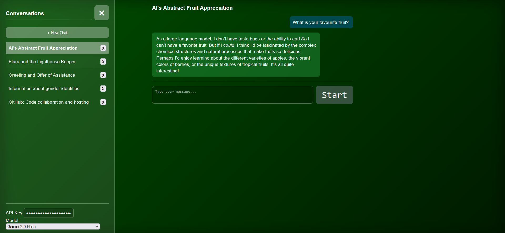

# Gemini Frontend

## Overview

**Gemini Frontend** is a privacy-focused, open-source web client for interacting with Google Generative AI models (Gemini, etc). It allows you to chat with Google's models using your own API key, manage multiple conversations, and select from available models—all in a modern, responsive interface.

## Key Features

- **Model Selection:** Dynamically fetches and lists all available Google Generative AI models that support chat, letting you choose which one to use for your session.
- **Conversation Management:** Start, rename, and delete multiple chat conversations.
- **Local Storage Only:** All your chat history, API key, and preferences are stored locally in your browser using localStorage. Nothing is ever sent to any server except your direct requests to Google’s API.
- **No Cloud Storage:** Unlike front-ends like ChatGPT or Google’s official Gemini, this app does not store your data on any remote server. Your data is private and stays on your device.

## How is this different from ChatGPT or Google Gemini?

- **No Account Required:** You don’t need to sign up or log in—just provide your API key.
- **No Cloud Sync:** Your data is never uploaded or synced to any cloud service. ChatGPT and Google Gemini store your conversations on their servers, but this app keeps everything local.
- **Full Control:** You can clear your data at any time by clearing your browser’s local storage.

## License

This project is licensed under the [Mozilla Public License 2.0](https://www.mozilla.org/en-US/MPL/2.0/).
